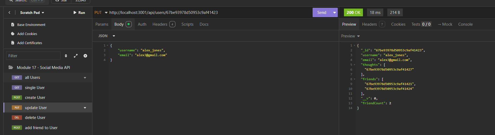
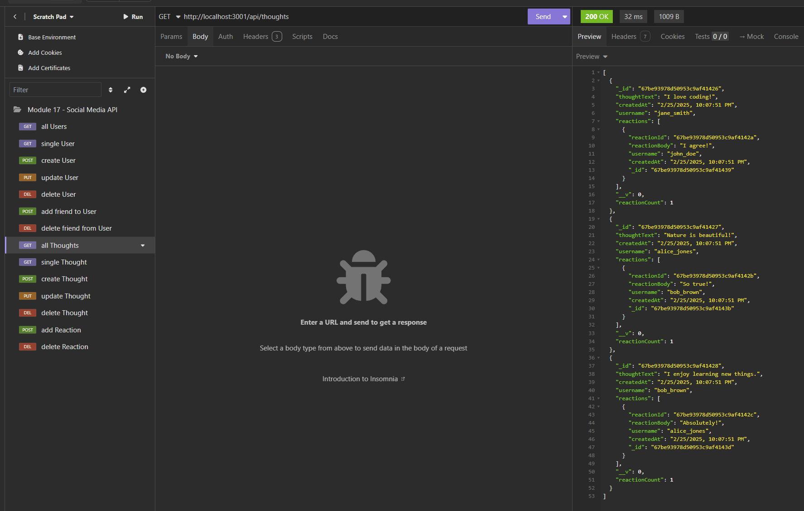
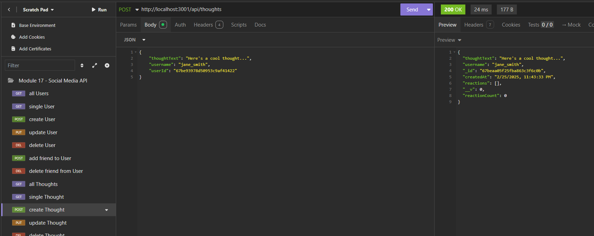
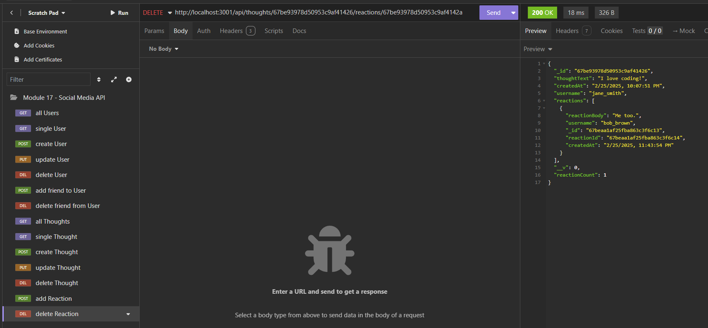

# Social Media API
[](https://opensource.org/licenses/ISC)

## Description:
Backend and API for a social network web application where users can share their thoughts, react to friends' thoughts, and create a friend list.

This app was created to practice building an API from scratch using Express.js for routing, a MongoDB database, and the Mongoose ODM.

## Table of Contents:
- [Technologies](#technologies)
- [Installation](#installation)
- [Usage](#usage)
- [License](#license)
- [Questions](#questions)

## Technologies:
- TypeScript
- MongoDB
- Mongoose
- Express
- Node

## Installation:
- Download or clone this repo.
- From its root directory, install the necessary packages with the following command:
```
$ npm i
```
- Seed the database:
```
$ npm run build
$ npm run seed
```

## Usage:
Watch this demo:  
[Demo video - google drive](https://drive.google.com/file/d/12xegC4CdTE68O7SvGn4XL8A7Ta4a_jK1/view?usp=sharing)

From this repo's root directory, start the application by running the following command:
```
$ npm run start
```

Hit any of the following endpoints:
- /api/users (GET and POST)
- /api/users/:userId (GET, PUT, and DELETE)
- /api/users/:userId/friends/:friendId (POST and DELETE)
- /api/thoughts (GET and POST)
- /api/thoughts/:thoughtId (GET, PUT, and DELETE)
- /api/thoughts/:thoughtId/reactions (POST)
- /api/thoughts/:thoughtId/reactions/:reactionId (DELETE)

Example of updating a User with PUT call:  


Exapmle of getting all Thoughts with GET call:  


Example of creating a new Thought with POST call:  


Example of deleting a Reaction with DELETE call:  


## License:
This application is covered under the [ISC](https://opensource.org/licenses/ISC) license.

## Questions:
Contact me via github: [kayla-e774](https://github.com/kayla-e774)  
Or email me at: <kengelstad16@gmail.com>
